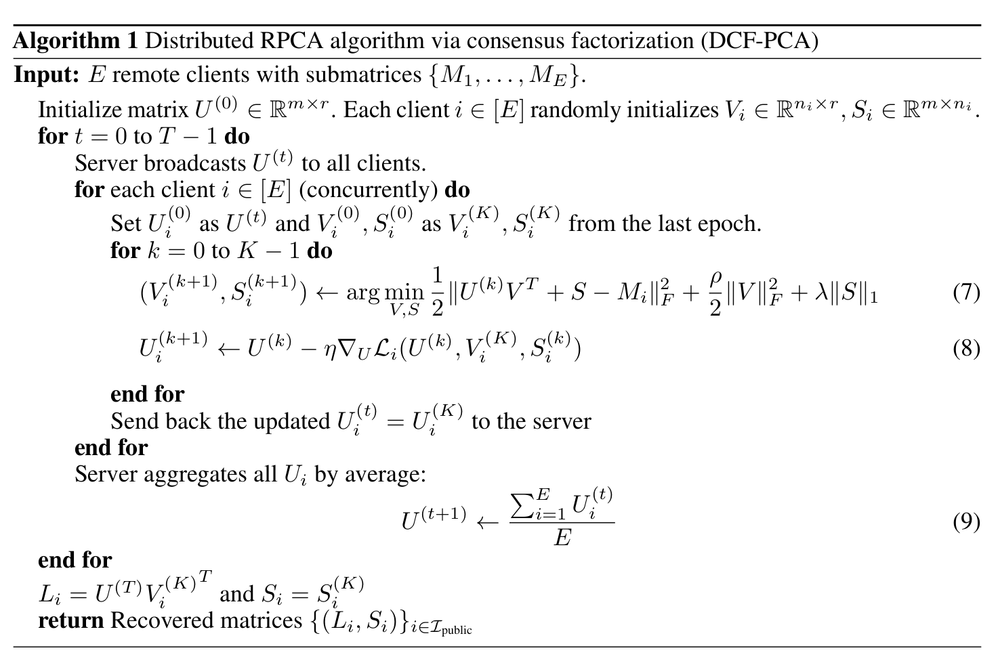

## Distributed Robust Principal Component Analysis

In this repository, code is for our paper "Distributed Robust Principal Component Analysis". ([arxiv](https://arxiv.org/abs/2207.11669))

The main goal of robust principal component analysis (RPCA) is to separate a given target matrix $M$ into 

$$M = L + S$$

where $L$ is a low-rank matrix, i.e., $rank(L) \leq r$, and $S$ is sparse, i.e., $\|S\|_0\le s$. The reason why this problem is widely discussed that PCA is prone to instability under sparse gross errors. 

A well-known solution to this non-convex problem is to relax it as [1,2]
$$\min_{L,S} \|L\|_* + \lambda\|S\|_1,\quad  s.t.\  M = L + S.$$

Various convex optimization tools can be applied to solve this convex problem, but most of these approaches require multiple steps of singular value decompositions (SVD). This makes it hard for them to be implemented distributedly and the algorithms are also hard to scale.

In our work, we present the first distributed robust principal component analysis algorithm based on consensus factorization (**DCF-PCA**). Formally, the distributed RPCA problem aims at solving the RPCA problem when the data matrix $M$ is scattered at $E$ different remote devices. DCF-PCA recovers global matrices $L$ and $S$ with limited communication budgets among devices.

$$M = [M_1\ M_2\ \dots\ M_E],\  M_i \in \mathbb R^{m\times n_i}$$

#### Reference

[1] Zhouchen Lin, Arvind Ganesh, John Wright, Leqin Wu, Minming Chen, and Yi Ma. Fast convex optimization algorithms for exact recovery of a corrupted low-rank matrix. 2009.

[2] Emmanuel J. Candès, Xiaodong Li, Yi Ma, and John Wright. Robust principal component analysis? J. ACM, 58(3), jun 2011.